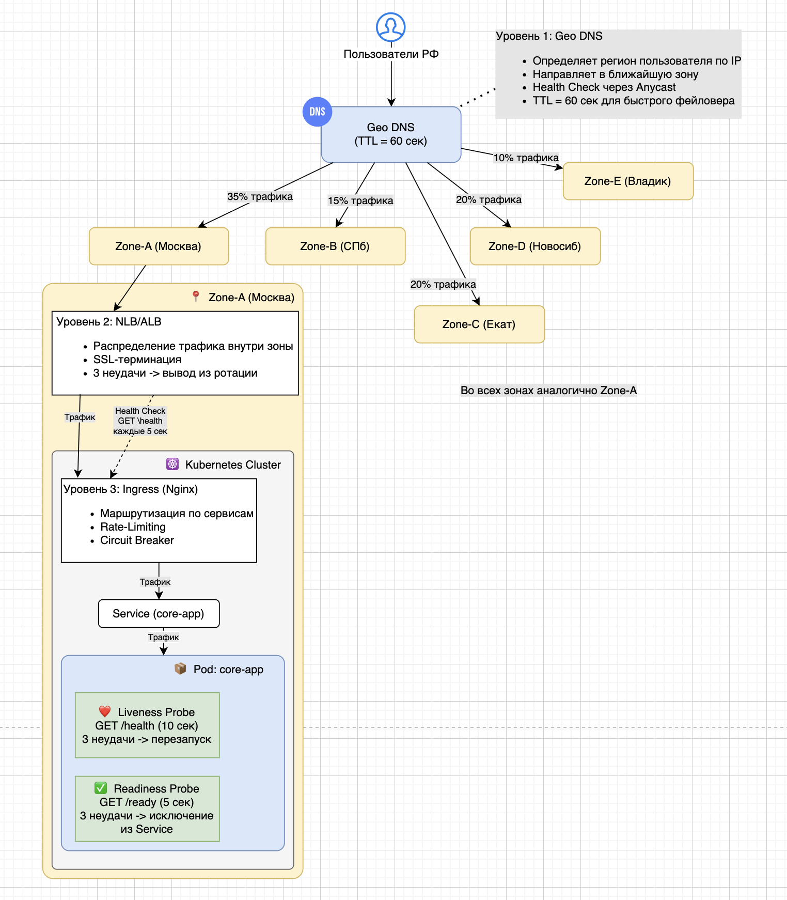
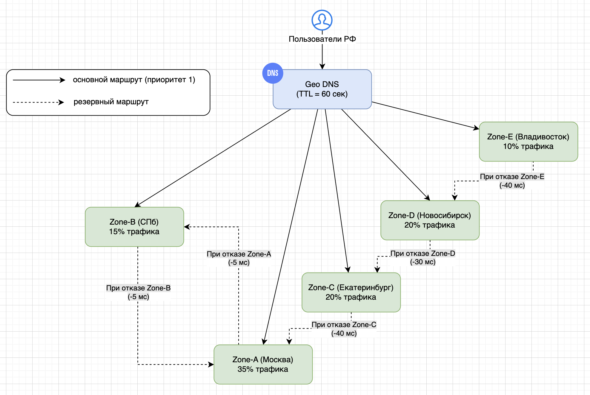
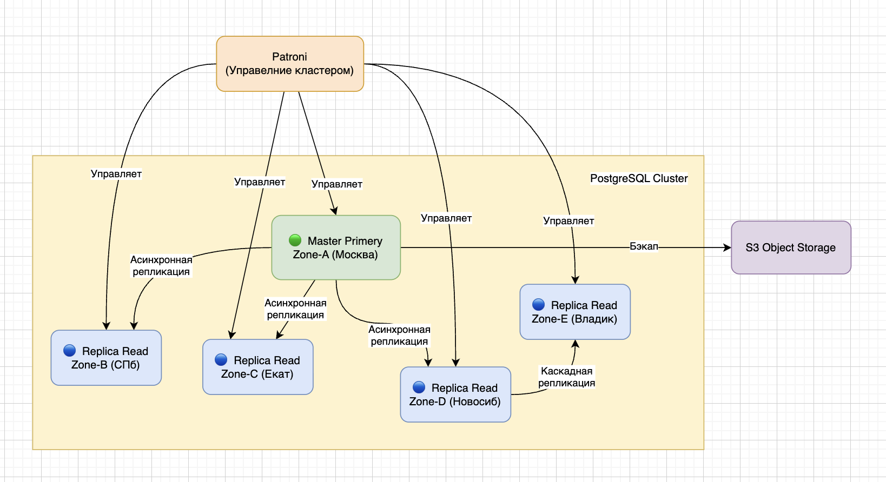

# Задание 1. Проектирование технологической архитектуры

## Анализ текущего состояния и проблем

### Текущие проблемы системы

- Медленная загрузка сайта - при 50 RPS (поиск) и 10 RPS (оформление) страницы грузятся минутами
- Нарушение SLA для B2B - партнер превышает лимит (250 RPS при согласованных 20 RPS), "съедая" ресурсы
- Падения приложения - команда узнает о проблемах от пользователей, каждый час простоя = 500 000 ₽ убытков
- Нет мониторинга - отсутствует proactive обнаружение проблем
- Географическая неоптимальность - единая точка входа для всех регионов РФ

### Бизнес-требования

- Доступность 99.9% (~9 часов простоя в год)
- RTO = 45 мин, RPO = 15 мин
- Покрытие всех часовых поясов РФ
- Одинаковое время загрузки для всех регионов
- Объём данных: 50 GB, рост ожидается

## Улучшения для устранения текущих проблем

| Проблема                                                               | Решение                         | Как это работает                                                                                                                                                                                                                                                                                                                                |
|------------------------------------------------------------------------|---------------------------------|-------------------------------------------------------------------------------------------------------------------------------------------------------------------------------------------------------------------------------------------------------------------------------------------------------------------------------------------------|
| Медленная загрузка страниц (50 RPS поиск, 10 RPS оформление)           | Внедрение Redis Cache           | Кэширование часто запрашиваемых данных (список продуктов, тарифы, предложения). Снижает нагрузку на PostgreSQL в 5–10 раз, сокращая время ответа с секунд до 50–200 мс.                                                                                                                                                                         |
| Нарушение SLA для B2B (партнер 250 RPS при лимите 20 RPS)              | Rate Limiting + Circuit Breaker | Ограничение на уровне Ingress и по API-ключу отсекает запросы сверх лимита 20 RPS. Circuit Breaker изолирует проблемного партнера при росте ошибок, защищая остальную систему.                                                                                                                                                                  |
| Падения приложения, медленное реагирование (500 тыс. ₽/час простоя)    | Полный observability стек       | Мониторинг и логирование развернуть централизованно в Zone-A (Москва) на выделенных узлах Kubernetes. Prometheus собирает метрики, Grafana визуализирует дашборды, AlertManager отправляет уведомления в Telegram/Slack при падении доступности, росте задержки или превышении 80% CPU. ELK Stack централизует логи для быстрого поиска причин. |
| Нет мониторинга (команда узнаёт от пользователей)                      | Proactive мониторинг + алерты   | Synthetic мониторинг из разных регионов проверяет доступность. При проблемах уведомление приходит за 5 минут до того, как пользователи заметят сбой.                                                                                                                                                                                            |
| Географическая неоптимальность (единая точка входа для всех регионов)  | 5 зон доступности + GeoDNS      | Пользователи направляются в ближайшую зону. Задержка для Дальнего Востока снижается с 150–200 мс до 20–30 мс.                                                                                                                                                                                                                                   |

## Проектирование целевой архитектуры. Архитектурные решения

### Стратегия масштабирования

Применяем комбинированную стратегию масштабирования:

*Вертикальное масштабирование (для БД):*
- Объём данных 50 GB (до 2-3 TB можно расти без шардирования)
- Вертикальное масштабирование проще в управлении
- Нагрузка на запись невысокая (10 RPS)

*Горизонтальное масштабирование (для приложений) HPA (Horizontal Pod Autoscaler):*
- Пиковые нагрузки от партнеров (250 RPS) требуют эластичности
- Проще распределить по 5 географическим зонам
- Отказ одной реплики не критичен для всей системы
- HPA позволяет автоматически добавлять/удалять реплики на основе CPU (70%) и RPS (50)

Параметры HPA для core-app:

```yaml
minReplicas: 3
maxReplicas: 10
metrics:
  - cpu: 70%
  - requests_per_second: 50
```

### Географическая распределённость - 5 зон

5 равноправных зон доступности в РФ:

| Зона    | Город           | Часовой пояс | Ожидаемая доля трафика | Роль                      |
|---------|-----------------|--------------|------------------------|---------------------------|
| Zone-A  | Москва          | UTC+3        | ~35%                   | Основной центр, Master БД |
| Zone-B  | Санкт-Петербург | UTC+3        | ~15%                   | Активная, Replica БД      |
| Zone-C  | Екатеринбург    | UTC+5        | ~20%                   | Активная, Replica БД      |
| Zone-D  | Новосибирск     | UTC+7        | ~20%                   | Активная, Replica БД      |
| Zone-E  | Владивосток     | UTC+10       | ~10%                   | Активная, Replica БД      |

**Обоснование выбора 5 зон:**
- Покрытие всех часовых поясов - разница между Москвой и Владивостоком составляет 7 часов. Без локальной зоны пользователи Дальнего Востока будут испытывать задержки 150-200 мс
- Дальний Восток - стратегически важный регион с потенциалом роста
- Сибирь и Урал - 40% населения РФ, высокая концентрация корпоративных клиентов
- СЗФО - резерв для Центра с минимальной задержкой
- Соответствие регуляторным требованиям - данные клиентов могут храниться в их регионе

**Конфигурация Kubernetes:** Выбираем независимые кластеры в каждой зоне, а не один растянутый.

Причины:
- Снижение зоны поражения - сбой в одном кластере не влияет на другие
- Сетевые задержки между регионами (Москва–Владивосток ~100-120 мс) делают единый кластер неэффективным
- Упрощение обновлений --rolling update с канареечным развертыванием
- Соответствие 99.9% доступности - отказ 2-х зон не остановит сервис

**Ресурсы каждой зоны:**

| Ресурс     | Zone-A (Мск)                 | Zone-B (СПб)                | Zone-C (Екат)               | Zone-D (Новосиб)            | Zone-E (Владик)            |
|------------|------------------------------|-----------------------------|-----------------------------|-----------------------------|----------------------------|
| K8s Nodes  | 10+                          | 8                           | 9                           | 9                           | 6                          |
| vCPU       | 40                           | 32                          | 36                          | 36                          | 24                         |
| RAM        | 160 GB                       | 128 GB                      | 144 GB                      | 144 GB                      | 96 GB                      |
| Storage    | 2 TB                         | 500 GB                      | 750 GB                      | 750 GB                      | 250 GB                     |
| БД         | Master                       | Replica                     | Replica                     | Replica                     | Replica                    |
| Ресурсы БД | 8 vCPU / 32 GB RAM / 500 GB  | 4 vCPU / 16 GB RAM / 250 GB | 4 vCPU / 16 GB RAM / 250 GB | 4 vCPU / 16 GB RAM / 250 GB | 2 vCPU / 8 GB RAM / 100 GB |


### Балансировка нагрузки

**Многоуровневая балансировка:**

Уровень 1: DNS (GeoDNS)
- Определяет регион пользователя по IP
- Направляет в ближайшую зону
- Health Check через Anycast
- TTL = 60 сек для быстрого фейловера

Уровень 2: Глобальный балансировщик (NLB/ALB)
- Распределение трафика внутри зоны
- Проверка health: /health endpoint (каждые 5 сек)
- SSL-терминация
- 3 неудачные проверки -> вывод из ротации

Уровень 3: Ingress Controller (Nginx)
- Маршрутизация по сервисам
- Rate Limiting (по API-ключам для партнеров)
- Circuit Breaker

**Health Check на уровне приложения (Kubernetes Probes):**
```yaml
# Для каждого микросервиса
livenessProbe:
  httpGet:
    path: /health
    port: 8080
  initialDelaySeconds: 30
  periodSeconds: 10
  failureThreshold: 3

readinessProbe:
  httpGet:
    path: /ready
    port: 8080
  initialDelaySeconds: 5
  periodSeconds: 5
  failureThreshold: 3
```

**Механизм распределения трафика по зонам:**
- Приоритет 1: GeoDNS направляет в ближайшую зону
- Приоритет 2: Если зона недоступна -> перенаправление в следующую по близости
  - Владивосток -> Новосибирск (задержка ~40 мс)
  - Новосибирск -> Екатеринбург (задержка ~30 мс)
  - Екатеринбург -> Москва (задержка ~40 мс)
  - СПб -> Москва (задержка ~5 мс)



### Стратегия фейловера

Стратегия включает четыре уровня, каждый из которых обрабатывает свой тип сбоя:

**Уровень 0: Локальный сбой (Pod / Node)**
- **Действие:** Автоматический перезапуск контейнера или перемещение Pod'а на другую рабочую ноду в пределах той же зоны.
- **Время восстановления:** Менее 1 минуты. Обеспечивается механизмами самовосстановления Kubernetes (ReplicaSet, Node Controller).

**Уровень 1: Сбой целой зоны доступности**
- **Действие:** Автоматическое переключение трафика. Если зона (например, Владивосток) перестает отвечать на Health Check, система перестает направлять туда пользователей. Трафик автоматически начинает идти на ближайшую здоровую зону (например, Новосибирск). Это происходит на уровне DNS.
- **Время восстановления:** 2-3 минуты (определяется TTL DNS в 60 секунд и временем обнаружения сбоя).

**Уровень 2: Сбой макро-региона (например, Москва + Санкт-Петербург)**
- **Действие:** Ручное или автоматическое переключение на другой географический регион. Например, если Москва и Санкт-Петербург недоступны, весь трафик из этих регионов перенаправляется на зону в Екатеринбурге.
- **Время восстановления:** 10-15 минут.

**Уровень 3: Глобальный сбой**
- Действие: Ручной фейловер на резервный центр обработки данных (возможно, в другом облаке или физическом ЦОД). Это экстренный сценарий на случай, если все 5 зон Yandex Cloud в РФ станут недоступны.
- Время восстановления: До 45 минут (в рамках RTO). Используются заранее подготовленные бэкапы и скрипты развертывания.

**Принципы переключения:**
- Приоритет 1: Пользователь всегда направляется в ближайшую к нему зону
- Приоритет 2: Если ближайшая зона недоступна, трафик перенаправляется в следующую по географической близости
- Приоритет 3: В случае отказа макро-региона, весь трафик консолидируется в оставшихся работающих зонах

**Особый сценарий: отказ Zone-A (Москва)**

Поскольку в Zone-A находится Master базы данных, ее отказ требует комплексного переключения:
- Трафик из Москвы и Центра автоматически перенаправляется в Zone-B (СПб) через GeoDNS
- Patroni автоматически выбирает новый Master БД из реплик (приоритет: Zone-B -> Zone-C -> Zone-D -> Zone-E)
- HPA в Zone-B масштабирует core-app для приема дополнительной нагрузки
- После восстановления Zone-A выполняется плановый возврат (failback) Master в Москву

**Время:** автоматическое переключение < 5 минут, общее восстановление - до 45 минут (RTO). Потеря данных - до 15 минут (RPO).

Пример переключения для Дальнего Востока:
Клиенты (Владивосток) -> DNS -> Зона Е (Владивосток) [ОСНОВНАЯ] - в случае сбоя -> Зона Д (Новосибирск) [РЕЗЕРВНАЯ]



### Конфигурация базы данных

Для обеспечения высокой производительности и отказоустойчивости базы данных мы используем PostgreSQL с асинхронной репликацией (Async Replication), управляемую через Patroni.

**Архитектура кластера PostgreSQL:**
- **Master (Primary):** Находится только в Zone-A (Москва). Принимает все запросы на запись (Insert/Update/Delete). Это единственная точка для записи, что упрощает управление согласованностью данных. Нагрузка на запись невысокая - всего 10 RPS.
- **Replicas (Read Replicas):** Находятся во всех остальных зонах (Zone-B, Zone-C, Zone-D, Zone-E). Они асинхронно синхронизируются с Master. Вся нагрузка на чтение (поиск, просмотр предложений, личный кабинет) распределяется между ними. Это позволяет значительно снизить нагрузку на Master и ускорить ответ для пользователей в их регионе.
- **Cascading Replication (Каскадная репликация):** Для Zone-E (Владивосток), чтобы уменьшить задержку синхронизации, реплика получает данные не напрямую из Москвы, а из Zone-D (Новосибирск).
- **Patroni:** Этот инструмент управляет кластером. В случае падения Master в Москве, он автоматически выберет новым лидером одну из реплик (например, в Zone-B), и система продолжит работу. Время переключения - менее 1 минуты.

**Резервное копирование:**
- **Полный бэкап:** `pg_dump` выполняется ежедневно и хранится в объектном хранилище (S3) в течение 30 дней.
- **WAL-архивация:** WAL архивируются в S3 каждые 5 минут. Это позволяет восстановить базу данных на любой момент времени (Point-in-Time Recovery, PITR) с потерей не более 15 минут (RPO).

**Решение по шардированию:**

На данном этапе **шардирование не применяется** по следующим причинам:
- Объём данных составляет 50 GB, что позволяет эффективно масштабироваться вертикально до 2-3 TB без необходимости шардирования
- Вертикальное масштабирование PostgreSQL проще в управлении и не требует изменения логики приложения
- Шардирование усложнит архитектуру без необходимости на текущем этапе 

При росте объёма данных до 500 GB+ планируется внедрение Citus (распределённый PostgreSQL) с шардированием по `client_id`.



## Итоговая схема технологической архитектуры

[InureTech_технологическая архитектура_to-be.drawio](drawio/InureTech_%D1%82%D0%B5%D1%85%D0%BD%D0%BE%D0%BB%D0%BE%D0%B3%D0%B8%D1%87%D0%B5%D1%81%D0%BA%D0%B0%D1%8F%20%D0%B0%D1%80%D1%85%D0%B8%D1%82%D0%B5%D0%BA%D1%82%D1%83%D1%80%D0%B0_to-be.drawio)


