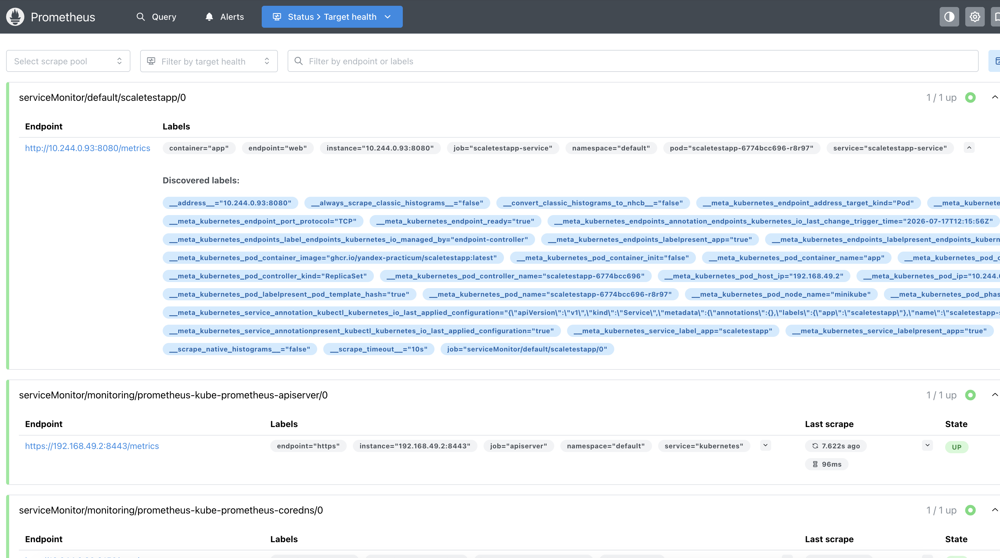
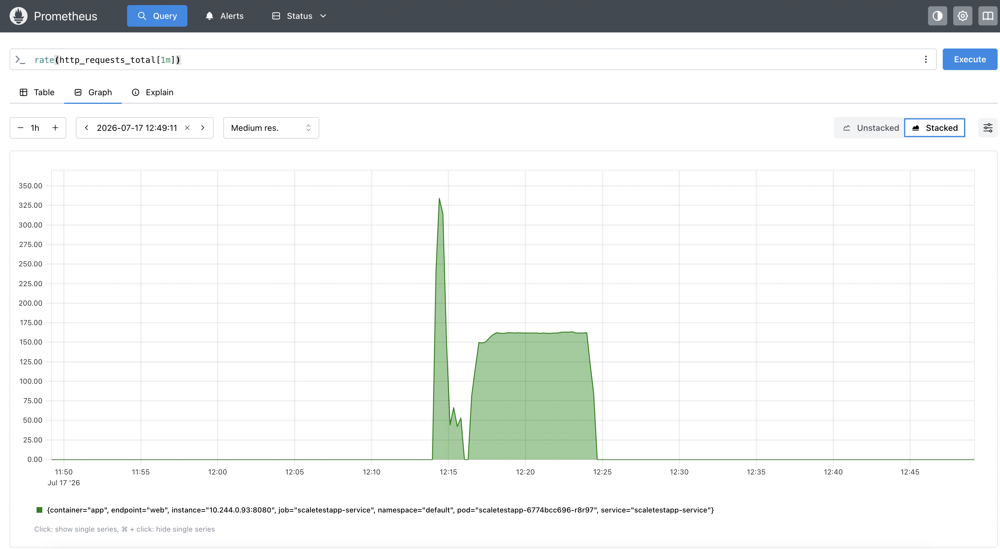
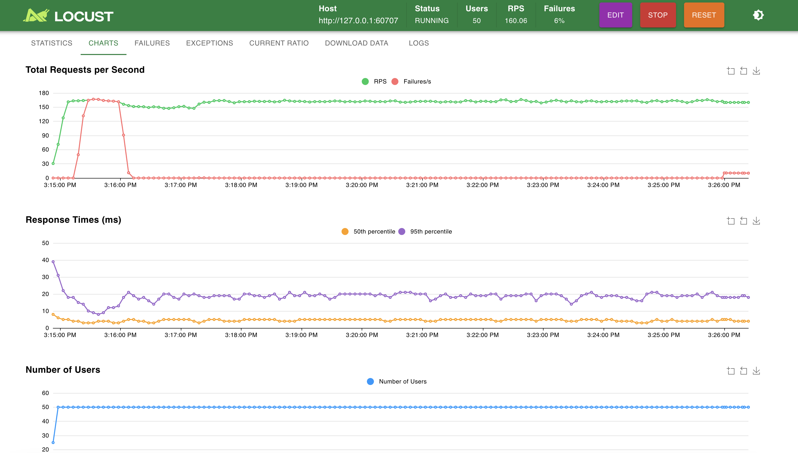
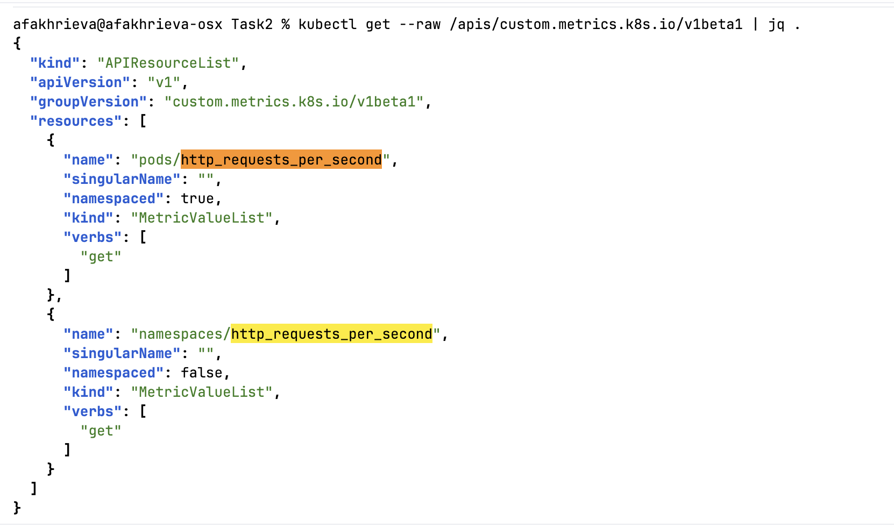
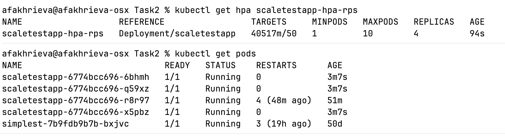
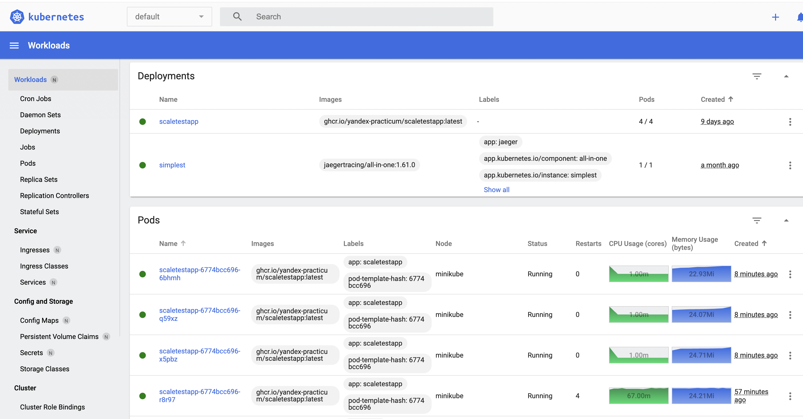

# Задание 2. Динамическое масштабирование контейнеров

## Часть 1. Динамическая маршрутизация на основании показателей утилизации памяти

### 1. Подготовка окружения

```bash
cd ./Task2

minikube start --driver=docker
minikube addons enable metrics-server
```

### 2. Манифест развертывания

Применяем манифест [deployment.yaml](deployment.yaml)
```bash
kubectl apply -f deployment.yaml
```

### 3. Манифест сервиса

Применяем манифест [service.yaml](service.yaml)
```bash
kubectl apply -f service.yaml
```

### 4. Настройка Horizontal Pod Autoscaler (HPA)

Применяем манифест [hpa.yaml](hpa.yaml)
```bash
kubectl apply -f hpa.yaml
```

Проверка
```bash
kubectl get hpa
```

### 5. Запуск нагрузочного теста

Устанавливаем locust и запускаем
```bash
brew install locust
locust
```
**Number of users:** 300 \
**Rump up**: 10


Логи [hpa-events.txt](hpa-events.txt)
```
Name:                                                     scaletestapp-hpa
Namespace:                                                default
Labels:                                                   <none>
Annotations:                                              <none>
CreationTimestamp:                                        Fri, 17 Jul 2026 10:01:35 +0300
Reference:                                                Deployment/scaletestapp
Metrics:                                                  ( current / target )
  resource memory on pods  (as a percentage of request):  81% (25096Ki) / 80%
Min replicas:                                             1
Max replicas:                                             10
Deployment pods:                                          2 current / 2 desired
Conditions:
  Type            Status  Reason              Message
  ----            ------  ------              -------
  AbleToScale     True    ReadyForNewScale    recommended size matches current size
  ScalingActive   True    ValidMetricFound    the HPA was able to successfully calculate a replica count from memory resource utilization (percentage of request)
  ScalingLimited  False   DesiredWithinRange  the desired count is within the acceptable range
Events:
  Type    Reason             Age   From                       Message
  ----    ------             ----  ----                       -------
  Normal  SuccessfulRescale  10m   horizontal-pod-autoscaler  New size: 2; reason: memory resource utilization (percentage of request) above target
```

### 6. Анализ результатов масштабирования

В ходе нагрузочного тестирования HPA успешно отработал в соответствии с заданными параметрами:
- **Целевой уровень утилизации памяти:** 80% от запрошенного лимита (`30 Mi`).
- **Фактическое потребление памяти:** в момент срабатывания HPA составило 81% (`25096 KiB`), что превысило целевой порог.
- **Реакция HPA:** количество реплик было увеличено с 1 до 2, о чем свидетельствует событие `SuccessfulRescale` в логах.
- **Состояние HPA:** все условия (`AbleToScale`, `ScalingActive`, `ScalingLimited`) имеют статус True или False с корректными причинами, что подтверждает корректную работу механизма.

Таким образом, динамическое масштабирование на основе утилизации памяти функционирует правильно и позволяет системе автоматически адаптироваться к росту нагрузки.

## Часть 2. Динамическая маршрутизация на основании показателей количества запросов в секунду

### 1. Установка Prometheus

```bash
helm repo add prometheus-community https://prometheus-community.github.io/helm-charts
helm repo update
helm install prometheus prometheus-community/kube-prometheus-stack -n monitoring --create-namespace \
  --set grafana.enabled=false \
  --set alertmanager.enabled=false
helm install prometheus-adapter prometheus-community/prometheus-adapter -n monitoring \
  --set prometheus.url=http://prometheus-kube-prometheus-prometheus.monitoring.svc \
  --set prometheus.port=9090
```

Проверяем, что все работает
```bash
kubectl get pods -n monitoring
```

### 2. Создание ServiceMonitor

Применяем манифест [service-monitor.yaml](service-monitor.yaml) и перезапускаем prometheus
```bash
kubectl apply -f service-monitor.yaml
kubectl delete pod -n monitoring -l app.kubernetes.io/name=prometheus
```

### 3. Prometheus Web UI

```bash
kubectl port-forward -n monitoring svc/prometheus-operated 9090:9090
```
Показывает время UTC





Запущен locust (время MSK) - показатели совпадают ~160 rps


### 4. Настройка метрики http_requests_per_second

Обновляет prometheus-adapter с конфигом для метрики `http_requests_per_second` [adapter-values.yaml](adapter-values.yaml)
```bash
helm upgrade prometheus-adapter prometheus-community/prometheus-adapter -n monitoring -f adapter-values.yaml
```


### 5. Настройка Horizontal Pod Autoscaler (HPA) по RPS

Отключаем `scaletestapp-hpa` и применяем новый манифест [hpa-rps.yaml](hpa-rps.yaml)
```bash
kubectl delete hpa scaletestapp-hpa
kubectl apply -f hpa-rps.yaml
```
Ожидаемо масштабировались до 4 реплик (160 rps / 50)


Дашборд


Логи [hpa-rps-events.txt](hpa-rps-events.txt)
```
Name:                                  scaletestapp-hpa-rps
Namespace:                             default
Labels:                                <none>
Annotations:                           <none>
CreationTimestamp:                     Fri, 17 Jul 2026 16:00:41 +0300
Reference:                             Deployment/scaletestapp
Metrics:                               ( current / target )
  "http_requests_per_second" on pods:  40794m / 50
Min replicas:                          1
Max replicas:                          10
Deployment pods:                       4 current / 4 desired
Conditions:
  Type            Status  Reason              Message
  ----            ------  ------              -------
  AbleToScale     True    ReadyForNewScale    recommended size matches current size
  ScalingActive   True    ValidMetricFound    the HPA was able to successfully calculate a replica count from pods metric http_requests_per_second
  ScalingLimited  False   DesiredWithinRange  the desired count is within the acceptable range
Events:
  Type    Reason             Age    From                       Message
  ----    ------             ----   ----                       -------
  Normal  SuccessfulRescale  8m23s  horizontal-pod-autoscaler  New size: 4; reason: pods metric http_requests_per_second above target

```

### 6. Анализ результатов масштабирования (по RPS)

В ходе нагрузочного тестирования на основе метрики `http_requests_per_second` HPA успешно отработал в соответствии с заданными параметрами:
- **Целевой уровень RPS на под:** 50 запросов в секунду.
- **Фактический уровень RPS:** в момент срабатывания HPA средний RPS на под превысил целевое значение, что привело к масштабированию.
- **Реакция HPA:** количество реплик было увеличено с 1 до 4, о чем свидетельствует событие `SuccessfulRescale` в логах.
- **Состояние HPA:** все условия (`AbleToScale`, `ScalingActive`, `ScalingLimited`) имеют статус `True` или `False` с корректными причинами, что подтверждает корректную работу механизма.

Таким образом, динамическое масштабирование на основе RPS функционирует правильно и позволяет системе автоматически адаптироваться к росту нагрузки.